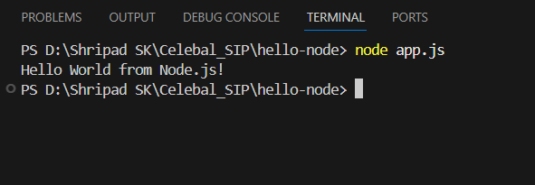
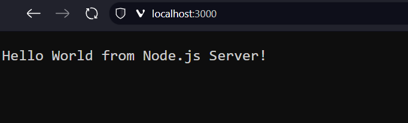

# Hello Node.js Server

A simple Node.js HTTP server that responds with "Hello World from Node.js Server!" message.

## Project Description

This is a basic Node.js application that creates an HTTP server running on port 3000. It demonstrates the fundamentals of creating a web server using Node.js built-in `http` module.

## Prerequisites

- Node.js installed on your system
- Basic knowledge of JavaScript and Node.js

## Installation

1. Clone or download this project
2. Navigate to the project directory:
   ```bash
   cd hello-node
   ```

## Usage

1. Start the server:
   ```bash
   node app.js
   ```

2. Open your web browser and navigate to:
   ```
   http://localhost:3000
   ```

3. You should see the message: "Hello World from Node.js Server!"

## Screenshots

### Terminal Output


The terminal shows the server starting successfully and listening on port 3000.

### Browser Output


The browser displays the "Hello World from Node.js Server!" message when accessing localhost:3000.


## Code Overview

The application consists of a single `app.js` file that:
- Imports the Node.js `http` module
- Creates an HTTP server that responds with a plain text message
- Listens on port 3000
- Logs a confirmation message when the server starts

## Technologies Used

- Node.js
- HTTP module (built-in)

## License

This project is for educational purposes.
